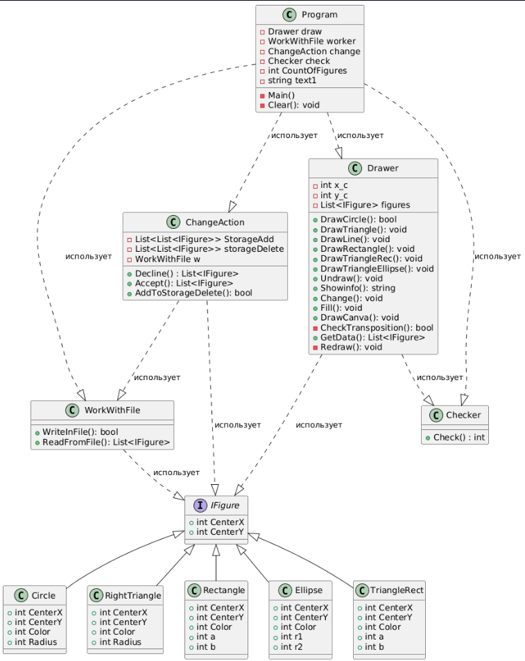
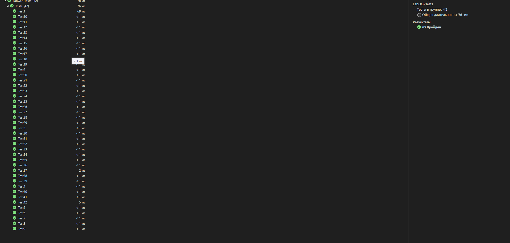

# Лабораторная работа 1 : Paint  Боровикова Егора, номер группы - (4)

## Краткое описание лабораторной работы
Это простой проект с использованием c# в качестве языка. 
Основные особенности проекта:
    
    1) Рисование простых фигур (круг, прямоугольный треугольник,  треугольник с углом 90°, прямоугольник и т.д.)
    2) Удаление этих фигур
    3) Создание фона из фигур
    4) Перемещение предоставленных фигур с обновлением рамки
    5) Простые и исправленные опции отмены / повтора
    6) Загрузка и сохранение рисунков в текстовом файле

Все тесты пройдены
### Результат

